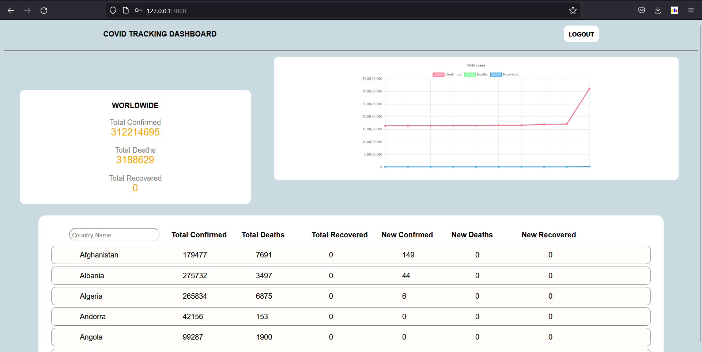

# Covid-Tracker-Dashboard

#

#

Clone the repository into your local setup and refer to the README.md file present in client and server for the setup of frontend and backend services respectively.
